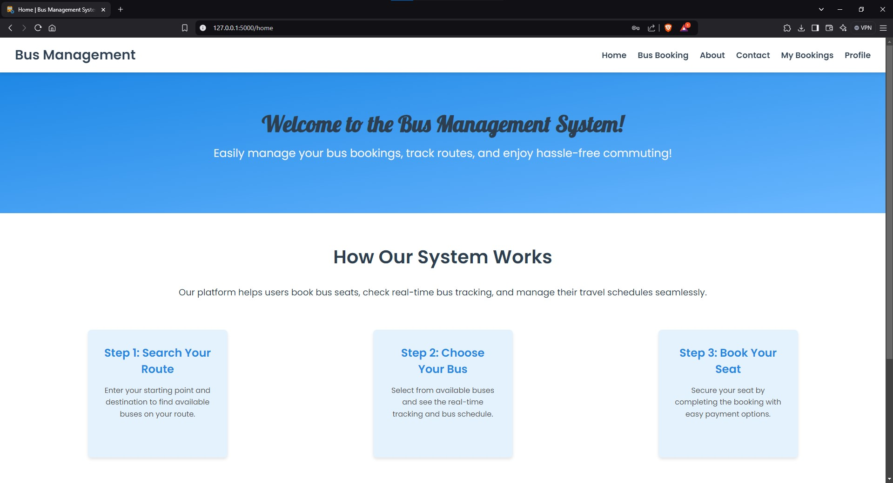
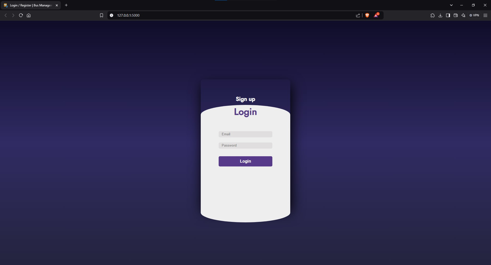
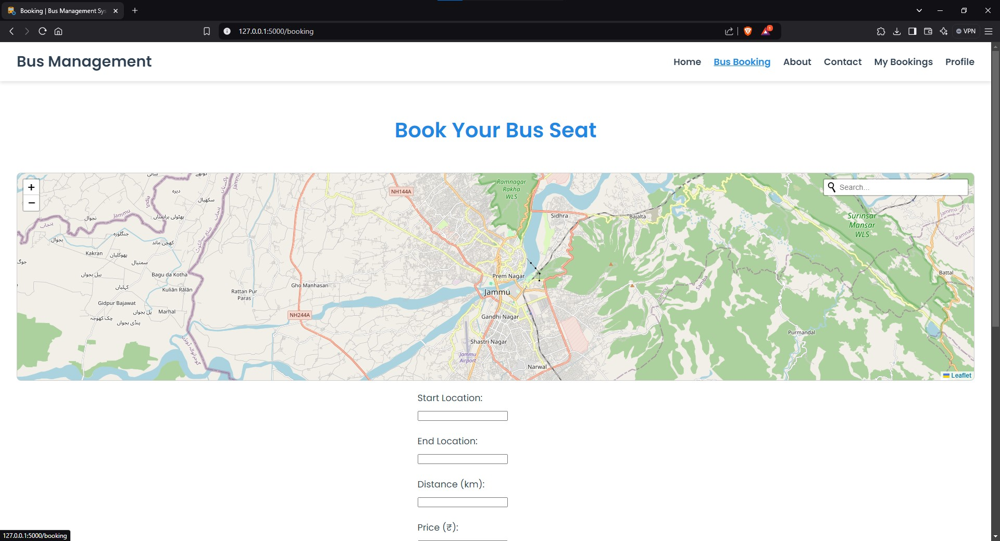
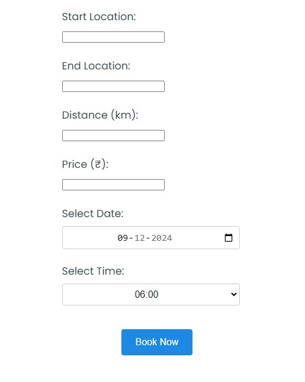
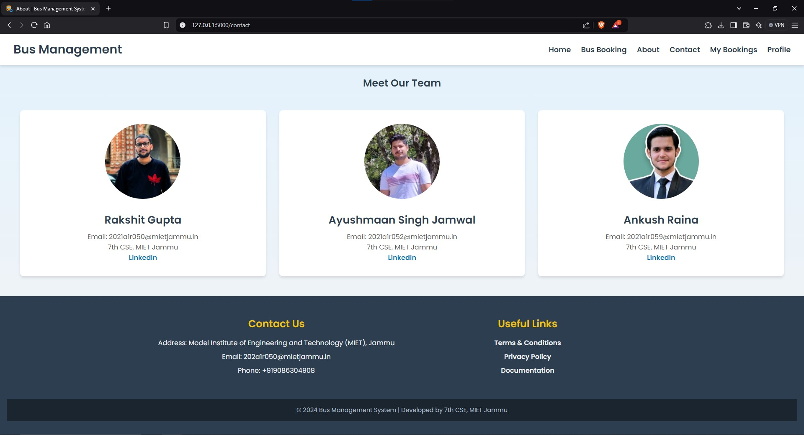
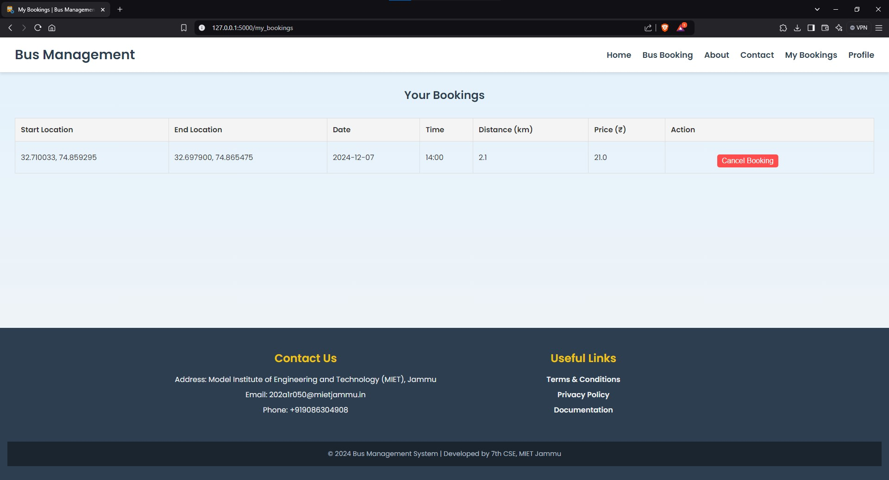
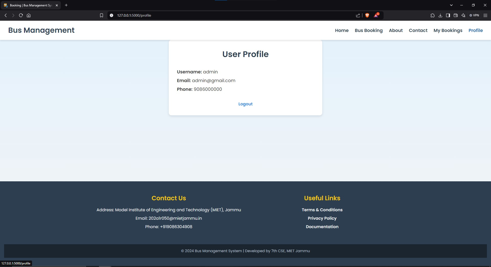
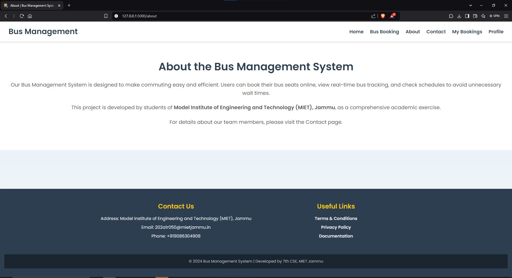

# Bus Management System

The **Bus Management System** is a web application designed to simplify the process of booking bus seats, managing routes, and accessing user profiles. It integrates a dynamic map for selecting start and end locations, with automatic route calculation and pricing based on distance.

---

## Table of Contents

- [Features](#features)
- [Folder Structure](#folder-structure)
- [Screenshots](#screenshots)
- [Tech Stack](#tech-stack)
- [Setup Instructions](#setup-instructions)
- [How to Use](#how-to-use)
- [Contact](#contact)

---

## Features

- **Login/Register**: Secure user authentication with MongoDB.
- **Interactive Bus Booking**: Book seats with route selection on an interactive map or search.
- **Dynamic Pricing**: Pricing calculated based on distance.
- **My Bookings**: View and cancel bookings.
- **Profile Management**: Access personal details and manage sessions.
- **Map Integration**: Search and select routes using OpenStreetMap and Leaflet.

---

## Folder Structure

```plaintext
.
├── static
│   ├── images
│   │   ├── ankush.jpg
│   │   ├── ayushmaan.jpg
│   │   ├── bus.png
│   │   ├── rakshit.jpg
│   ├── index.css
│   ├── script.js
│   ├── style.css
├── templates
│   ├── about.html
│   ├── base.html
│   ├── booking.html
│   ├── bookings.html
│   ├── contact.html
│   ├── home.html
│   ├── index.html
│   ├── policy.html
│   ├── profile.html
│   ├── tc.html 
├── ppt
│   ├── SIH ppt.pdf
├── README.md
├── app.py
```

---

## Screenshots

Here are some screenshots of the application in action:

1. **Home Page**:
   

2. **Login Page**:
   

3. **Sign Up Page**:
   

4. **Booking Page**:
   

5. **Booking Confirmation**:
   

6. **Contact Page**:
   

7. **My Bookings**:
   

8. **Profile Page**:
   

9. **About Page**:
   

---

## Tech Stack

- **Backend**: Python (Flask)
- **Frontend**: HTML, CSS, JavaScript
- **Database**: MongoDB (MongoDB Atlas)
- **Libraries**:
  - Flask
  - Flask-PyMongo
  - Leaflet.js (for interactive maps)
  - Leaflet Routing Machine (for route calculation)
  - Leaflet Control Geocoder (for geolocation search)

---

## Setup Instructions

### 1. Clone the repository

```bash
git clone https://github.com/Rakshitgupta9/bus-management-system.git
cd bus-management-system
```

### 2. Install required libraries

Use `pip` to install the required libraries from the command line:

```bash
pip install Flask flask_pymongo werkzeug
```

### 3. Set up MongoDB

Ensure you have a MongoDB database set up on MongoDB Atlas. You can use the following URI format in your `app.py`:

```python
app.config['MONGO_URI'] = 'mongodb+srv://<username>:<password>@<cluster_name>/bus?retryWrites=true&w=majority'
```

Replace `<username>`, `<password>`, and `<cluster_name>` with your MongoDB Atlas credentials.

### 4. Run the Application

Run the Flask application:

```bash
python app.py
```

Visit `http://localhost:5000` in your browser to access the Bus Management System.

---

## How to Use

1. **Login/Register**: 
   - If you are a new user, sign up by providing your username, email, phone, and password.
   - If you already have an account, log in with your email and password.

2. **Bus Booking**:
   - Use the map or search bar to select the start and end locations.
   - The system will calculate the distance and price automatically.
   - Choose your desired booking date and time.
   - Click **Book Now** to finalize your booking.

3. **My Bookings**:
   - After booking, you can view your bookings on the **My Bookings** page.
   - You also have the option to cancel a booking if needed.

4. **Profile**:
   - View and update your personal details on the **Profile** page.

---

## Contact

Created by [Rakshit Gupta](https://www.linkedin.com/in/rakshit9/)

- Email: [2021a1r050@mietjammu.in](mailto:2021a1r050@mietjammu.in)
- GitHub: [Rakshitgupta9](https://github.com/Rakshitgupta9)

---
